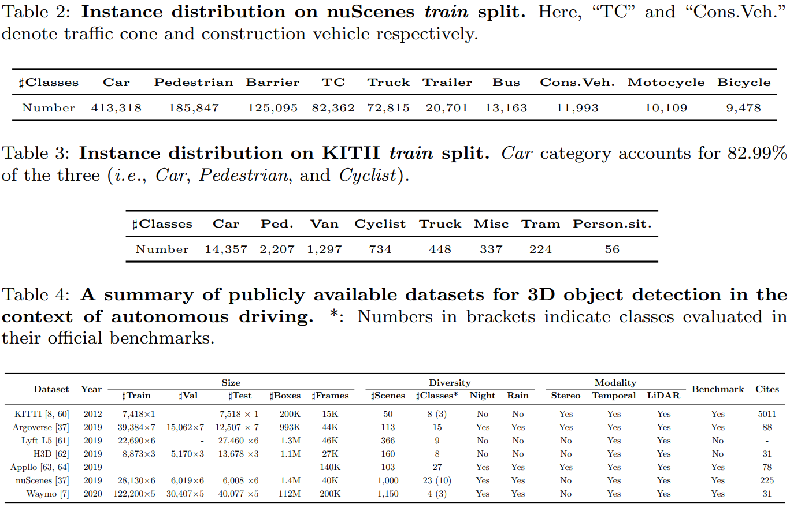

[](https://arxiv.org/abs/2106.10823)
[](https://github.com/rui-qian/SoTA-3D-Object-Detection/graphs/commit-activity)
[](https://GitHub.com/rui-qian/SoTA-3D-Object-Detection/issues/)
[](http://makeapullrequest.com)


# 3D Object Detection for Autonomous Driving: A Survey (Pattern Recognition 2022)

This is the official repository of **3D Object Detection for Autonomous Driving: A Survey** (Pattern Recognition 2022),  a comprehensive survey with regard to 3D object detection in the context of autonomous driving. Please feel free to <a href="mailto:qianruii@126.com">contact me</a> or [create an issue](https://help.github.com/en/github/managing-your-work-on-github/creating-an-issue) on this page if you have new results to add or any suggestions!
For details, please refer to:

**3D Object Detection for Autonomous Driving: A Survey** <br/>

**Authors**: [Rui Qian](https://github.com/rui-qian), [Xin Lai](https://github.com/laiguzi), [Xirong Li](https://github.com/li-xirong)

[\[arXiv\]](https://arxiv.org/abs/2106.10823)
[\[elsevier\]](https://doi.org/10.1016/j.patcog.2022.108524)

## Citation
If you find this code useful in your research, please consider citing our work:
```
@inproceedings{qian_2022_survey,
title={3D Object Detection for Autonomous Driving: A Survey}, 
booktitle = {Pattern Recognition},
volume = {xxx},
pages = {xxxx},
year = {2022},
publisher={Elsevier},
author = {Rui Qian and Xin Lai and Xirong Li},
}
```

# Abstract
>Autonomous driving is regarded as one of the most promising remedies to shield human beings from severe crashes. To this end, 3D object detection serves as the core basis of perception stack especially for the sake of path planning, motion prediction, and collision avoidance etc. Take a quick glance at the progress we have made, we attribute challenges to **visual appearance recovery in the absence of depth information from images, representation learning from partially occluded unstructured point clouds, and semantic alignments over heterogeneous features from cross modalities**. Despite existing efforts, 3D object detection for autonomous driving is still in its infancy. Recently, a large body of literature have been investigated to address this 3D vision task. Nevertheless, rather a few investigations have looked into collecting and structuring this growing knowledge. We therefore aim to fill this gap in a comprehensive survey, encompassing all the main concerns including sensors, datasets, performance metrics and the recent state-of-the-art detection methods, together with their pros and cons. Furthermore, we provide quantitative comparisons with the state of the art. **A case study on fifteen selected representative literature is presented, involved with runtime analysis, error analysis, and robustness analysis**. Finally, we provide concluding remarks after an in-depth analysis of the surveyed works and identify the avenues for future work.

# 1. INTRODUCTION


Dream sheds light on reality. It is a dream that autonomous vehicles hit the roads legally, functioning wisely as good as human drivers or even better, responding timely to various unconstrained driving scenarios, and being fully free of the control of human drivers, a.k.a. Level 5 wit “driver off” in Fig. 2. Let the dream be realized, thousands of new employment opportunities shall be created for those physically impaired (**Mobility**), millions of lives shall be rescued from motor vehicle-related crashes (**Safety**), and billions of dollars shall be saved from disentangling traffic accidents and treating the wounded (**Economics**). It is a reality that there is still no universal consensus on where we are now and how we shall go next. As illustrated in Fig. 2, We are largely above level 2 but under or infinitely close to level 3 by taking into account the following three social concerns: (1) **Safety and Security**. Rules and regulations are still blank,
which shall be developed by governments to guarantee the safety for an entire trip. (2) **Law and Liability**. How to define the major responsibility and who will take that responsibility shall be identified both ethically and clearly. (3) **Acceptance**. Long-term efforts shall be made to establish the confidence and trust for the whole society, before autonomous driving can be finally accepted. This survey paper will take a structured glance at 3D object detection, one of the core techniques for autonomous driving.


Perception in 3D space is a prerequisite in autonomous driving. A fully understanding of what is happening right now in front of the vehicle will facilitate downstream components to react accordingly, which is exactly what 3D object detection aims for. 3D object detection perceives and describes what is surrounded us via assigning a label, how it is occupied via drawing a bounding box, and how far away it is from an ego vehicle via giving a coordinate. Besides, 3D detection even provides a heading angle that indicates orientation. It is these upstream information from perception stack that enables downstream planning model to make decisions.

## 1.1 Tasks and Challenges
Fig. 1 presents an overview of 3D object detection task from images and point clouds. The whole goal of 3D object detection is to recognize the objects of interest by drawing an oriented 3D bounding box and assigning a label. Consider two commonly used 3D object detection modalities, i.e. images and point clouds, the key challenges of this vision task are strongly tied to the way we use, the way we represent, and the way we combine. With only images on hand, the core challenge arises from the absence of depth information. Although much progress has been made to recover depth from images [2, 3], it is still an ill-posed inverse problem. The same object in different 3D poses can result in different visual appearance in the image plane, which is not conducive to the learning of representation [4]. Besides, given that camera is passive sensor (see Sec. 2.2.1), images are naturally vulnerable to illumination (e.g., nighttime) or rainy weather conditions. With only point clouds on hand, the key difficulty stems from the representation learning. Point clouds are sparse by nature, e.g. in works [5, 6], non-empty voxels normally account for approximately 1%, 3% in a typical range setup on Waymo Open [7] dataset and KITTI [8] dataset respectively. Point clouds are irregular and unordered by nature. Directly applying convolution operator to point clouds will incur “desertion of shape information and variance to point ordering” [9]. Besides, point clouds are 2.5D in practice as they are point miss in (a), external-occlusion in (b), self-occlusion in (c) [10], as indicated in Fig. 1. Without the umbrella of convolutional neural networks, one way is to present point clouds as voxels. The dilemma is that scaling up voxel size will loss resolution and consequently degrade localization accuracy while scaling down its size will cubically increase the complexity and memory footprints as the input resolution grows. Another way is to present point clouds as point sets. Nevertheless, around 80% of runtime is occupied by point retrieval, say, ball query operation, in light of the poor memory locality [11]. With both images and point clouds on hand, the tricky obstacle often derives from semantic alignments. Images and point clouds are two heterogeneous media, presented in camera view and real 3D view, finding point-wise correspondences between LiDAR points and image pixels results in “feature blurring” [12].


## 1.2 Targeted Scope, Aims, and Organization
We review literature that are closely related to 3D object detection in the context of autonomous driving. Depending on what modality we use, existing efforts are divided into the following three subdivisions: (1) **image based** [15–22], which is relatively inaccurate but several orders of magnitude cheaper, and more interpretable under the guidance of domain expertise and knowledge priors. (2) **point cloud based** [5, 6, 10, 23–29], which has a relatively higher accuracy and lower latency but more prohibitive deployment cost compared with its image based counterparts. (3) **multimodal fusion based** [12, 30–34], which currently lags behind its point cloud based counterparts but importantly provides a redundancy to fall-back onto in case of a malfunction or outage.

Fig. 3 presents a summary showing how this survey differs from existing ones on 3D object detection. 3D object detection itself is an algorithmic problem, whereas involved with autonomous driving makes it an application issue. As of this main text in June 2021, we notice that rather a few investigations [13, 14, 35, 36] have looked into this application issue. Survey [13] focuses on 3D object detection, also taking into account indoor detection. Survey [36] involves with autonomous driving but it concentrates on multi-modal object detection. Survey [35] covers a series of related subtopics of 3D point clouds (e.g., 3D shape classification, 3D object detection and tracking, and 3D point cloud segmentation etc.). Note that survey [35] establishes it taxonomy based on network architecture, which fails to summarize the homogeneous properties among methods and therefore results in overlapping in the subdivisions, e.g. multi-view based and BEV based are the same in essence in terms of learning strategies. As far as we know, only survey [14] is closely relevant to this paper, but it fails to track the latest datasets (e.g., nuScenes [37], and Waymo Open [7]), algorithms (e.g., the best algorithm it reports on KITII [8] 3D detection benchmark is AVOD [31]\[IROS′18: 71.88\] vs. BtcDet [10]\[AAAI′22: 82.86\] in this paper), and challenges, which is not surprising as much progress has been made after 2018.

The aims of this paper are threefold. First, notice that no recent literature exists to collect the growing knowledge concerning 3D object detection, we aim to fill this gap by starting with several basic concepts, providing a glimpse of evolution of 3D object detection, together with comprehensive comparisons on publicly available datasets being manifested, with pros and cons being judiciously presented. Witnessing the absence of a universal consensus on taxonomy with respect to 3D object detection, our second goal is to contribute to the maturity of the taxonomy. To this end, we are cautiously favorable to the taxonomy based on input modality, approved by existing literature [13, 14]. The idea of grouping literature based on their network architecture derives from 2D object detection, which fails to summarize the homogeneous properties among methods and therefore results in overlapping in the subdivisions, e.g., multi-view based and BEV based are the same representation in essence. Another drawback is that several plug-and-play module components can be integrated into either region proposal based (two-stage) or single shot based (one-stage). For instance, VoTr [5] proposes voxel transformer which can be easily incorporated into voxel based one stage or two stage detectors. Notice that diverse fusion variants consistently emerge among 3D object detection, existing taxonomy in works [13, 14] needs to be extended. For instance, works [38, 38] are sequential fusion methods (see Sec.3.3.1), which are not well suited to existing taxonomy. We therefore define two new paradigms, i.e. sequential fusion and parallel fusion, to adapt to underlying changes and further discuss which category each method belongs to explicitly, while works [13, 14] not. Also, we analyze in deep to provide a more fine-grained taxonomy above and beyond the existing efforts [13, 14] on image based methods, say, result-lifting based and feature-lifting based depending on intermediate representation existence. Finally, we open point-voxel branch to classify newly proposed variants, e.g. PV-RCNN [39]. By constrast, survey [35] directly groups PV-RCNN into “Other Methods”, leaving the problem unsolved. Our third goal aims to present a case study on fifteen selected models among surveyed works, with regard to runtime analysis, error analysis, and robustness analysis closely. We argue that what mainly restricts the performance of detection is 3D location error based on our findings. Taken together, this survey is expected to foster more follow-up literature in 3D vision community.

The rest of this paper is organized as follows. Section 2 introduces background associated with foundations, sensors, datasets, and performance metrics. Section 3 reviews 3D object detection methods with their corresponding pros and cons in the context of autonomous driving. Comprehensive comparisons of the state-of-the-arts are summarized in Section 4. We conclude this paper and identify future research directions Section 5. We also set up a regularly updated project page on: https://github.com/rui-qian/SoTA-3D-Object-Detection.

# 2. BACKGROUND  
## 2.1. Foundations 

Let denote input data, say, LiDAR signals or monocular images,  denote a detector parameterized by . Consider an -dimensional result subset with  predictions, denoted by , we have  

  <div align=center></div>  
 where  denotes a certain prediction of detector .gif) with bounding box  and its probabilistic score . In the context of autonomous driving,  is usually parameterized as portrayed in Fig. 4, which indicates the volume of the object of interest and its position relative to a reference coordinate system that can be one of the sensors equipped on a ego-vehicle. We notice that attributes encoded by (d) in Fig. 4 are orthogonal and therefore result in a more lower information redundancy compared with (a), (b), (c). In this paper, we adopt the form of (d) as most previous works
[6, 24, 25, 40, 41] do. 


 ##  2.2. Sensors 

We human beings leverage visual and auditory systems to perceive the real world when driving, so how about autonomous vehicles? If they were to drive  like a human, then to identify what they see on the road constantly is the way to go. To this end, sensors matter. It is sensors that empower vehicles a series of abilities: obstacles perception, automatic emergency braking, and collision avoidance etc. In general, the most commonly used sensors can be divided into two categories: passive sensors and active sensors [43]. The on going debate among industry experts is whether or not to just equip vehicles with camera systems (no LiDAR), or deploy LiDAR together with on-board camera systems. Given that camera is considered to be one of the typical representatives of passive sensors, and LiDAR is regarded as a representative of active ones, we  first introduce the basic concepts of passive sensors and active sensors, then take camera and LiDAR as examples to discuss how they serve the autonomous driving system, together with pros and cons being manifested in Table 1. 

 ### 2.2.1. Passive Sensors 

Passive sensors are anticipated to receive natural emissions emanating from both the Earth’s surface and its atmosphere. These natural emissions could be natural light or infrared rays. Typically, a camera directly grabs a bunch of color points from the optics in the lens and arranges them into an image array that is often referred to as a digital signal for scene understanding. Primarily, a monocular camera lends itself well to informative color and texture attributes, better visual recognition of text from road signs, and high frame rate at a negligible cost etc. Whereas, it is lack of depth information, which is crucial for accurate location estimation in the real 3D world. To overcome this issue, stereo cameras use matching algorithms to align correspondences in both left and right images for depth recovery [2]. While cameras have shown potentials as a reliable vision system, it is hardly sufficient as a standalone one given that a camera is prone to degrade its accuracy in cases where luminosity is low at night-time or rainy weather conditions occur. Consequently equipping autonomous vehicles with an auxiliary sensor, say active counterparts, to fall-back onto is necessary, in case that camera system should malfunction or disconnect in hazardous weather conditions. 

 ### 2.2.2. Active Sensors 

 Active sensors are expected to measure reflected signals that are transmitted by the sensor, which are bounced by the Earth’s surface or its atmosphere. Typically, Light Detection And Ranging (LiDAR) is a point-and-shoot device with three basic components of lens, lasers and detectors, which spits out light pulses that will bounce off the surroundings in the form of 3D points, referred to as “point clouds”. High sparseness and irregularity by nature and the absence of texture attributes are the primary characteristics of a point cloud, which is well distinguished from image array. Since we have already known how fast light travels, the distance of obstacles could be determined without effort. LiDAR system emits thousands of pulses that spin around in a circle per second, with a 360 degree view of surroundings for the vehicles being provided. For example, Velodyne HDL-64L produces 120 thousand points per frame with a 10 Hz frame rate. Obviously, LiDAR is less affected by external illumination conditions (e.g., at night-time), given that it emits light pulses by itself. Although LiDAR system has been hailed for high accuracy and reliability compared with camera system, it does not always hold true. Specifically, wavelength stability of LiDAR is susceptible to variations in temperature, while adverse weather (e.g., snow or  fog) is prone to result in poor signal-to-noise ratio in the LiDAR’s detector. Another issue with LiDAR is the high cost of deployment. A conservative estimate according to Velodyne, so far, is about $75,000 [14]. In the foreseeable future of LiDAR, how to decrease cost and how to increase resolution and range are where the whole community is to march ahead. As for the former, the advent of solid state LiDAR is expected to address this problem of cost decrease, with the help of several stationary lasers that emit light pulses along a fixed field of view. As for the latter, the newly announced Velodyne VLS-128 featuring 128 laser pulses and 300m radius range has been on sale, which is going to significantly facilitate better recognition and tracking in terms of public safety. 

 ### 2.2.3. Discussion 

Fatalities occurred with autonomous vehicles have already increased the society’s grave concern about safety. If autonomous vehicles were to hit the road legally, they at least need to satisfy three basic requirements: high accuracy, high certainty, and high reliability. To this end, sensor fusion incorporating the merits of two worlds (camera vs. LiDAR) is going to be necessary. From a sensor standpoint, LiDAR provide depth information close to linearity error with a high level of accuracy, but it is susceptible to adverse weather (e.g., snow or fog). Camera is intuitively much better at visual recognition in cases where color or texture attributes are available, but they are not sufficient as a standalone system as aforementioned. Note that certainty is still an important yet largely unexplored problem. A combination of LiDAR and camera is anticipated to ensure detection accuracy and improve prediction certainty. With regard to reliability, two facets should be considered: sensor calibration and system redundancy. Sensor calibration undoubtedly increases the difficulty of deployment and directly affects the reliability of the whole system. Studies [58, 59] have looked into calibrating sensors to avoid drift over time. System redundancy is to have a secondary sensor to fall-back onto in case of a malfunction or outage in extreme scenarios. Although balancing affordability and safety has been a long-term ethical dilemma, the community should be keenly aware of the safety risk of over-reliance on a single sensor. 

 ## 2.3. Dataset 

The availability of large-scale datasets has been continuously fostering the community with the advent of data-driven era. As regards 3D object detection, we summarize publicly available datasets [7, 8, 37, 60–65] in the context of autonomous driving in Table 4, out of which the KITTI [8], nuScenes [37], and Waymo Open [7] are the typical representatives. In a sequel, we selectively introduce these three datasets with regard to their size, diversity, pros and cons accordingly.

**Dataset size.** The KITTI manually annotates 200K boxes among 15K frames, with 7,481, 7,518 samples for training and testing respectively. Rather, the training set is subdivided into 3,712 and 3,769 samples for train, val split as a common practice initially introduced by 3DOP [66]. The nuScenes manually labels 1.4M boxes among 40K frames, with 28,130, 6,019 and 6,008 frames for training, validation, and testing accordingly. Waymo Open, encouragingly annotates 112M boxes among 200K frames, with 122,200, 30,407 and 40,077 for training, validation, and testing. Note that only the labels for training/validation are available, whereas none of them provide annotations for testing. Competitors are required to submit predictions to the online leaderboard for fairly assessing on test set. 

**Diversity.** The KITTI provides 50 scenes over 8 classes in Karlsruhe, Germany, out of which only Car, Pedestrian, and Cyclist are considered for online evaluation. Three difficulty levels (i.e., Easy, Moderate, and Hard) for its protocol are introduced depending on the height of 2D bounding boxes, the level of occlusion and truncation. The nuScenes collects 1,000 sequences over 23 classes in Boston and Singapore, out of which only 10 classes are considered for 3D object detection. The Waymo Open consists of 1,150 sequences over 4 classes in Phoenix and San Francisco, out of which only three classes are assessed similar to KITTI. It is worth mentioning that both nuScenes and Waymo Open acquire  their data under multiple weather (e.g., rainy, foggy, and snowy etc.) and lighting (e.g., daytime and nighttime) conditions throughout a day, whereas KITTI only captures its dataset on sunny days. 

**Pros and cons.** These three datasets manifested above indeed catalytically foster the academics. KITTI, as a pioneer, has profoundly influences the whole community in terms of data acquisition, protocol and benchmark. Nevertheless, as we mentioned above, KITTI is recorded in daytime on sunny days, without taking lighting and weather conditions into account, resulting a relative lower diversity compared with nuScenes and Waymo Open. Real dataset tends to suffer from class imbalance as it is true to life. According to our statistics in Table 2, 50% categories account for only 6.9% of total annotations, which clearly reflects a long-tail distribution on nuScenes. This phenomenon also holds true for KITTI as indicated in Table 3. 



| *See also:*                                                |
| ---------------------------------------------------------- |
| KITTI dataset:  http://www.cvlibs.net/datasets/kitti/      |
| Argoverse dataset:  https://www.argoverse.org/             |
| Lyft L5: https://level-5.global/data/?source=post_page     |
| ApolloScape dataset: http://apolloscape.auto/              |
| nuScene: https://www.nuscenes.org/nuscenes#data-collection |
| Waymo Open: https://waymo.com/open/                        |

##  2.4. Performance Metrics 

3D object detection adopts the Average Precision (AP) as its primary performance metrics, all of which stem from the same ideology as its 2D counterparts [67]. We first revisit the vanilla form of AP metric, and then recognize subtle  connections and differences of dataset-specific AP adopted among commonly used benchmarks. 

**Revisiting.** Consider a prediction subset  in descending order by confidence score , a prediction  is considered as true positive if the ratio of overlapping area between Bi and its assigned ground-truth, namely, the Intersection over Union (IoU), exceeds a certain threshold, otherwise false positive. The zigzag-like precision-recall curve can easily be plotted and AP is just the area under the curve. Notice that accurately calculating the related area is difficult, PASCAL VOC [67] established an alternative instead.  

*Interpolated  Metric* is formulated as the mean precision calculated at a recall subset R of which N evenly spaced recall levels are composed, that is 

<div align=center></div>  
 where .  For each recall level r, its corresponding precision is *interpolated* by taking into account the maximum precision of which recall value is greater than or equal to , denoted by 

<div align=center></div>  
**KITTI Benchmark.** KITTI adopts standard *Interpolated  Metric* as its official metric for assessing detector .gif). Usually two leaderboard is considered, i.e. 3D detection and Bird’s Eye View (BEV) detection. 3D detection evaluates  with a rotated  threshold of 0.7, 0.5, 0.5 for *Car*, *Pedestrian* and *Cyclist* accordingly. The principles of 3D detection largely holds true for BEV detection, except for the calculation of  , which is calculated by projecting the bounding box from 3D pace into the ground plane. Note that from 08.10.2019, KITTI turns to 40 recall levels [1/40, 2/40, 3/40, ..., 1] instead of 11 recall levels [0, 1/10, 2/10, ..., 1] as suggested in [68], with recall level 0 being reasonably removed.  

**nuScenes Benchmark.** nuScenes uses NuScenes Detection Score (NDS)  as its official metric for evaluating detector .gif). Consider a mean average error subset  of which translation, size, orientation, attribute and velocity are composed, denoted by , we have                             

<div align=center></div>              
where mAP indicates mean Average Precision. NDS jointly justifies a weighted average of mAP and mean average errors of set E among 10 classes. It is worth noting that mAP is calculated by a bird-eye-view center distance of thresholds {0.5m, 1m, 2m, 4m} rather than standard box-overlap. 

**Waymo Benchmark.** Waymo Open leverages *Interpolated  Metric* and Average Precision weighted by Heading (APH) as its primary metric for evaluating detector .gif). To compute AP, Waymo evaluates on 21 equally spaced recall levels [0, 1/20, 2/20, ..., 1] in Equation 2 with an IoU threshold of 0.7, 0.5 for vehicles, pedestrians respectively. To compute APH, the heading accuracy is incorporated into true positives, each of which is weighted by , where  and are subject to , indicating the predicted azimuth and its assigned ground truth accordingly. Waymo breaks down its difficulty into two levels: LEVEL_1 lends itself to boxes with at least five LiDAR signals, while LEVEL_2 is suited for all non-empty ones. 

# 3. TAXONOMY AND REVIEW 

Fig. 5 presents a pipeline of 3D object detection in general. Having only images on hand, the core challenge arises from the absence of depth information. Usually two lines exist: one is to break down this 3D vision task into 2D object detection [69–75] and depth estimation [2, 3], which lifts these estimated results into 3D space via geometric properties and constraints. The other line is to directly lift 2D image features into 3D space via computing a point cloud [41, 45, 47, 76–78], termed as Pseudo LiDAR or learning a latent depth distribution [4, 79–81]. Having only point clouds on hand, the key difficulty stems from the representation learning over sparse, irregular, and unordered point clouds.  Also two ways exist mainly: one is to first voxelize an irregular point cloud into regular voxel grids and then learn feature representations in an explicit way. Nevertheless, the other is to leverage PointNet-like block [82] or Graph Neural Networks (GNNs) [83] to learn permutation-invariant representations in an implicit fashion. Nowadays, combining the merits of these two lines reveals a new fashion trend. What if having both of them on hand? The tricky obstacle often derives from semantic representation (what to fuse), alignment (how to fuse), and consistency (when to fuse) for multimodal fusion based on what we have already learnt from these two preceding modalities. 


Depending on what we feed to .gif) internally during inference, we frame our taxonomy along three dimensions: (1) image based, (2) point cloud based, and (3) multimodal fusion based, ordered chronologically in which each method emerges. Table 5 selectively manifests several core literature structured along each dimension, which is expected to leave the readers a clear picture in his or her mind. In what follows, we present image based in Section 3.1,  and point cloud based in Section 3.2. Multimodal fusion based is addressed in Section 3.3. 


## 3.1. Image based Methods 

Depth estimation from images is still an ill-posed problem that are not fully understood yet [2, 3]. Errors from depth recovery inherently contribute to the major factor of the performance gap between image based and point cloud based [19]. Focusing on the inverse issue, it is the way of recovering depth and the way of use that collected knowledge that determines how the intermediate representation is lifted. Depending on intermediate representation existence, we divide this group into the following two subdivisions: (1) result-lifting based, (2) feature-lifting based. Table 5 selectively lists several significant contributions concerning the subject. 

### 3.1.1. Result-lifting based Methods

Works in this group break down .gif) into two vision tasks: 2D object detection and depth estimation [15–22]. The underlying principle is that the spatial location of the associated objects can be empirically inferred with regard to the visual appearance. To that end, Mono3D [44] scores proposals with location prior, object shape, size, and semantics with the hypothesis that objects are close to the ground plane via minimizing energy function. Deep3DBox [16] leverages the geometric properties that the perspective projection of 3D corners should tightly touch at least one side of the 2D bounding box. GS3D [17] relies on the observation that the top center of a 3D bounding box should be close to the top midpoint of the 2D bounding box when projected onto the image plane. Stereo R-CNN [18] exploits geometric alignment with keypoints, yaw angle, and object shape using left and right proposal pairs. Literature [19, 21, 84] fully exploits semantic properties as well as dense geometric constraints in monocular imagery. We notice that these methods are over-reliance on feature engineering and hinder them from further extending to general scenarios. For instance, works [15, 20, 44] require external data for training. Keypoint constraints in  works [18, 19, 84] are more likely to be vulnerable to slim and tall objects, say, Pedestrians. To what extent works in this group rely on domain expertise determines to what extent efforts in this group can be generalized largely. 

### 3.1.2. Feature-lifting based Methods 

Works in this group develop .gif) via lifting 2D image features into 3D space via computing a point cloud intermediately [41, 45, 47, 76–78] or learning a categorical depth distribution directly [4, 80]. To this end, works [41, 45, 76] first uses a stand-alone depth estimation network to obtain disparity map, then back-projects 2D coordinates associated with each pixel in image plane into 3D space, and finally lends itself to independent point cloud based detectors. Notice that the depth estimation error grows quadratically at long ranges, Pseudo-LiDAR++ [77] uses sparse but accurate real LiDAR signals as “landmarks” to correct and de-bias depth errors. Observe that preceding networks are trained separately, Pseudo-LiDAR E2E [78] goes one step further by making the entire pipeline trainable end to end. We note that Pseudo-LiDAR signals in works [41, 76, 77] are internally accompanied by noises that stem from errors in depth estimation, which reflect in two aspects: (1) Pseudo-LiDAR signals are slightly off relative to the real LiDAR ones with a local misalignment. (2) depth artifacts commonly exist in the vicinity of an object along with a long tail [41]. Works [4, 80] also point out that the independent networks, say depth estimation, make this 3D representation sub-optimal concerning the non-differentiable transformation from 2D coordinates into 3D space. Consequently, instead of computing an intermediate point cloud, the other scheme wants to incorporate 3D geometry into image based networks and learn a latent depth distribution [4, 79, 80] explicitly or implicitly [81] in an end-to-end manner. DSGN [4] and CaDNN [80] encode visual appearance into 3D feature volumes, jointly optimizing depth and semantic cues for 3D detection. LIGA-Stereo [79] turns to real LiDAR signals for the high-level geometry-aware supervisions and beyond under the guidance of a teacher network. 


 ### 3.1.3. Summary 

Fig. 6 illustrates the evolution of image based. Works in this group are divided into result-lifting based and feature-lifting based accordingly. Result-lifting based depends on domain expertise to design 3D representation and resorts to prior knowledge for template matching [44] or geometric constraints for recovery [16, 17, 84]. Feature-lifting based wants to compute an intermediate representation, say Pseudo LiDAR[41, 45, 76] or 3D feature volumes [4, 79, 80]. As the absence of depth information, we note that works [4, 15, 20, 41, 44, 76– 78, 80] rely on additional data for training. For an autonomous system, redundancy is indispensable to guarantee safety apart from economic concerns, so image based methods are poised to make a continuing impact over the next few years. 

## 3.2. Point Cloud based Methods 

Convolutional Neural Networks (CNNs) has always been applied in computer vision for its capability of exploiting spatially-local correlations in dense regular grids [91] (e.g., images). Whereas, point clouds are sparse in distribution, irregular in structure, and unordered in geometry by nature. Consequently,  convolving against a point cloud directly will lead to a gross distortion of representation [9]. To address issues above, works [6, 24, 25] voxelize their inputs to lend themselves to convolution operator adaptively, while works [40, 51, 51] turns to the recent advances of learning over point sets [82, 83, 92, 93] for help instead. Depending on representation learning strategies, we therefore divide existing works into the following three groups: (1) voxel based, (2) point based, and (3) voxel-point based. 

### 3.2.1. Voxel based Methods 

Works in this group voxelize irregular point clouds to 2D/3D compact grids and then collapse it to a bird’s-eye-view 2D representation on which CNNs effectively convolve against [5, 6, 10, 23–29, 48, 49, 55–57, 85, 86]. Typically, VoxelNet [24] rasterizes point clouds into volumetric dense grids, followed by 3D CNNs that convolve along each dimension. Notice that the computation overheads and memory footprints grow cubically in VoxelNet, SECOND [25] leverages sparse convolution operation to get rid of unnecessary computation squandered by unavailing zero-padding voxels. To thoroughly remove 3D CNNs layers, PointPillars [6] elongates voxels into pillars that are arrayed in a BEV perspective. Note that PointPillars decreases the resolution in vertical axis in essence which is detrimental to the learning of representation. As a tradeoff, noticeable efforts stretch back to voxels. Voxel R-CNN [28] aggregates voxel-wise features from 3D convolutional volumes for proposal refinement. SE-SSD [27] jointly supervises a student network under the guidance of the distilled knowledge injected by its teacher. Works [55–57] incorporate multi-scale voxelization strategies into feature aggregation. Works [5, 29, 85] exploit long-range contextual dependencies among voxels inspired by recent success of Transformers [94] in computer vision. Works [10, 86] integrate shape learning strategy to the deteriorating point cloud quality that caused by adverse weather, occlusions, and truncations etc. It is worth mentioning that voxel based approaches benefit from bird-view representation, which possess less scale ambiguity and minimal occlusions [48, 49]. 

### 3.2.2. Point based Methods 

Works in this group utilize permutation invariant operators to implicitly capture local structures and fine-grained patterns without any quantization in order to retain the original geometry of a raw point cloud [40, 51, 52]. To this end, PointRCNN [40] leverages PointNet-like block [92] to learn semantic cues associated with foreground points over which 3D proposals are generated in a bottom-up fashion. Notice that PointNet series are exhausted with the process of upsampling and broadcasting semantic cues back into the relevant points, 3DSSD [51] closely revisits the sampling strategy with feature distance, compounded by Euclidean distance, to safely remove it. Encouraged by the promising performance on classification and semantic segmentation from point clouds [83, 95, 96], Point-GNN [52] reasons on local neighborhood graphs constructed from point clouds, on which each node iteratively summarizes semantic cues from intermediate reaches of its neighbors. Point based approaches are internally time-consuming with a ball query complexity of . Note that works [40, 51] leverage multi-scale and multi-resolution grouping to achieve an expanding receptive field, which make latency even severe as points in  grow. 

### 3.2.3. Point-voxel based Methods 

Works in this group reveal a new fashion trend to integrate the merits of both worlds together: voxel based [6, 24, 25] approaches are computationally effective but the desertion of fine-grained patterns degrades further refinement, while point based methods [40, 51, 52] have relatively higher latency but wholly preserve the irregularity and locality of a point cloud [39, 50, 53, 87, 88]. STD [50] applies PointNet++ to summarize semantic cues for sparse points, each of which is then voxelized to form a dense representation for refinement. PVRCNN [39] deeply integrates the effectiveness of 3D sparse convolution [25] and the flexible receptive fields of PointNet-like set abstraction [92] to learn more discriminative semantics. SA-SSD [53] interpolates 3D sparse convolution features for raw point clouds on which an auxiliary network is applied to endow  voxel features with structure-aware capability. BADet [88] exploits long-range interactions iteratively among detection candidates, wherein local neighborhood graphs are constructed to facilitate a boundary-aware receptive field in a coarse to-fine manner.  


 ### 3.2.4. Summary 

Fig. 7 illustrates the evolution of point cloud based. Works in this group are divided into voxel based, point based, and point-voxel based respectively, among which voxel based appears to be dominant, as evidenced by Fig. 7. Voxel based is easily amenable to efficient hardware implementations with distinguished accuracy and relatively lower latency. Point based easily retains the spatially-local structure of a point cloud at the cost of taking longer feedforward time than those based on voxels. Comparing the three subdivisions, voxel based is still the most promising direction currently existing concerning real-time applications, say autonomous driving.  

## 3.3. Multimodal Fusion based Methods 

Intuitively, single modality itself has its own defects, a joint treatment appears to be a potential opportunity to failure cases. Nevertheless, multimodal fusion based has still trailed its point cloud based counterparts thus far. What,  how, and when to fuse have not been full understood yet [36]. Depending on to what extent these two modalities are coupled, we divide existing efforts into sequential fusion based and parallel fusion based. As the names suggest, if data flow has more than one independent path through the networks, then it is considered as parallel, otherwise sequential. The former emphasizes that the data flow of different modalities can pass through networks concurrently, while the latter emphasizes that the data flow of different modalities only has one single path to flow through networks successively. In what follows, we analyze these two paradigms as regards fusion evolutions, connections, and concerns to meet the requirements. 

### 3.3.1. Sequential Fusion based Methods

Works in this group are characterized by 2D driven 3D pipelines in a sequential manner, wherein the input of downstream depends heavily on the output of upstream [38, 89]. Frustum PointNets [89] first leverages a mature 2D CNN object detector to predict 2D proposals, each of which are then transformed to 3D space in order to crop corresponding frustum candidates, followed by point cloud based detectors for segmentation and detection. Frustum-ConvNet [38] generates a sequence of frustums that slide along the optical axis perpendicular to 2D image plane, which are summarized as frustum-wise features by PointNet blocks and arrayed as a BEV feature map for fully convolutional network. Works in this group resort to off-the-shelf 2D detectors for prior knowledge, with 3D search space being dramatically reduced. Whereas, they also indicate a fatal risk that the failure of 2D detectors is bound to deteriorate all subsequent pipelines, which violates the original intention of providing redundancy during difficult conditions rather than just complementary and we therefore argue that sequential fusion based may not be well-suited for autonomous driving for the sake of safety.  

###  3.3.2. Parallel Fusion based methods  

Works in this group are decoupled from the single modality. Suppose that one of the branches is cut off, the network will still work if adjusted appropriately, say hyper-parameters. Depending on at what point these semantic representations from single modality are fused, a further subdivision for parallel fusion based can be identified: (1) early fusion, (2) deep fusion, and (3) late fusion.  

*Early fusion* fuses different modalities at the data preprocessing point, which is not commonly used in light of the big noise of feature alignment at low level semantics. PointPainting [12] takes as inputs raw point clouds, compounded by segmentation scores that are predicted from the associated images, with the help of an independent segmentation network. *Deep fusion* fuses different modalities at the intermediate point. MV3D [30] takes as inputs the bird-view, front view, and images, fusing intermediate convolution features at stage two. AVOD [31] further extends fusion strategy to stage one to enrich more informative semantics for proposal generation. Observe that works [30, 31] fuse futures in a roi-wise manner, ContFuse [32] further fuses multi-scale convolutional features via continuous convolution in a pixel-wise fashion. Notice that pixel-wise fusion is vulnerable to faraway objects due to the difficulty of finding corresponding pixels for the sparse LiDAR signals at long ranges, MMF [90] exploits multiple related subtasks (e.g., ground estimation, depth completion, and 2D object detection etc.) to enhance the learning of cross-modality fusion. Note that existing efforts treat semantics from different modalities equally, 3D-CVF [33] employs attention mechanism to adaptively fuse semantics from point clouds and the associated images. *Late fusion* fuses the outputs of different modalities at the decision point. CLOCs [34] fuses the outputs of 2D and 3D detections in decision level via exploiting the consistency of geometries and semantics. 

### 3.3.3. Summary 

Fig. 8 illustrates the evolution of multimodal fusion based. What to use. Consider the most commonly used sensors for autonomous driving: camera and LiDAR. Preceding works [12, 30–34, 38, 89, 90] all take images and point clouds as inputs. How to fuse. Efforts have been made to align semantics of different levels at different scales. Works [30, 31, 34, 38, 89] exploit roi-wise fusion. Works [12, 32, 33, 90] leverage point-wise fusion. When to use. Cross-modality fusion can happen at any time during the forward propagation: say early fusion [12], deep fusion [30–33, 90], and late fusion [34]. In retrospect of the evolution of this group, we notice that multimodal fusion based still lags far behind its point cloud based counterparts. We attribute the performance gap to the difficulty of semantic alignments. First, semantics from images and point clouds are heterogeneous as they are presented in different views [33] (i.e., camera view vs. real 3D view). Consequently, finding point-wise correspondences is difficult as the transformation from LiDAR points to image pixels is a many-to-one mapping and vice versa. Such an ambiguity is referred as “feature blurring” in PointPainting [12]. Second, images are arrayed in dense grids, while point clouds are distributed in sparse points. To what extent semantics are aligned by forcing these two modalities to have the same size for aggregation remains untouched. Finally, operations that we use to crop and resize features may not be as accurate as expected [34]. 


#  4. EVALUATION  

This section holds an apples-to-apples comparison of the state-of-the-arts on the widely used KITTI dataset, more recent nuScenes and Waymo dateset (Sec. 4.1). A case study based on fifteen selected models is given in Sec. 4.2, with respect to runtime analysis (Sec. 4.2.2), error analysis (Sec. 4.2.3), and robustness analysis (Sec. 4.2.4).  

##  4.1. Comprehensive Comparison of the State-of-the-Arts 

Table 6 summarizes the 3D detection performance on the KITTI Dataset. Image based methods have currently trailed the performance of point clouds counterparts thus far, which should be ascribed to depth ambiguity. Point clouds based methods still predominate KITTI benchmark due to low latency and high accuracy by resorting to 3D sparse convolution. Multimodal fusion based methods are closing the gap with point clouds counterparts somewhat. As mentioned above, fusing these two modalities together is non-trivial due to view misalignment. Noticeably, on the one hand, monocular or stereo cameras indeed bring extra source information as a supplementary, which circumvent the risk of over-reliance on a single sensor. On the other hand, multiple sensors hinder the runtime and make it hard to deploy given the requirement of continuous synchronization. Table 7 and Table 8 present the 3D detection performance on the more recent nuScenes dataset and Waymo dataset, respectively. Although works that report performances on nuScenes or Waymo are not as common as KITII currently, assessing the effectiveness of detectors on these two large-scale datasets shall be necessary in the foreseeable future, regardless of dataset size or diversity as evidenced in Table 4. 


## 4.2  Case Study  

###  4.2.1. Experimental Setup 

Fifteen models are selected from the surveyed works depending on whether the official source code and the corresponding pretrained parameters are available. Notice that all our experiments are conducted on KITTI dataset by directly reloading official pretrained parameters with default settings. We follow KITII protocol to evaluate on the val split for the most important Car category of moderate difficulty based on  metric with an IoU threshold 0.7. For the ease of reproducibility, all materials are available online: https://github.com/rui-qian/SoTA-3D-Object-Detection. 

| MOdels             | Literature   | Source Code                                                  | Parameters                                                   |
| ------------------ | ------------ | ------------------------------------------------------------ | ------------------------------------------------------------ |
| SA-SSD             | CVPR'2020    | [SA-SSD](https://github.com/skyhehe123/SA-SSD)               | [GoogleDrive](https://drive.google.com/file/d/1WJnJDMOeNKszdZH3P077wKXcoty7XOUb/view?usp=sharing) |
| PV-RCNN            | CVPR'2020    | [OpenPCDet](https://github.com/open-mmlab/OpenPCDet)         | [GoogleDrive](https://drive.google.com/file/d/1lIOq4Hxr0W3qsX83ilQv0nk1Cls6KAr-/view?usp=sharing) |
| Voxel R-CNN        | AAAI'2021    | [OpenPCDet](https://github.com/open-mmlab/OpenPCDet)         | [GoogleDrive](https://drive.google.com/file/d/19_jiAeGLz7V0wNjSJw4cKmMjdm5EW5By/view?usp=sharing) |
| Part-A<sup>2</sup> | TPAMI'2021   | [OpenPCDet](https://github.com/open-mmlab/OpenPCDet)         | [GoogleDrive](https://drive.google.com/file/d/10GK1aCkLqxGNeX3lVu8cLZyE0G8002hY/view?usp=sharing) |
| PointRCNN          | CVPR'2019    | [OpenPCDet](https://github.com/open-mmlab/OpenPCDet)         | [GoogleDrive](https://drive.google.com/file/d/1BCX9wMn-GYAfSOPpyxf6Iv6fc0qKLSiU/view?usp=sharing) |
| SECOND             | Sensors'2018 | [OpenPCDet](https://github.com/open-mmlab/OpenPCDet);[second](https://github.com/traveller59/second.pytorch) | [GoogleDrive](https://drive.google.com/file/d/1-01zsPOsqanZQqIIyy7FpNXStL3y4jdR/view?usp=sharing) |
| PointPillars       | CVPR'2019    | [OpenPCDet](https://github.com/open-mmlab/OpenPCDet);[pointpillars](https://github.com/SmallMunich/nutonomy_pointpillars) | [GoogleDrive](https://drive.google.com/file/d/1wMxWTpU1qUoY3DsCH31WJmvJxcjFXKlm/view?usp=sharing) |
| CaDDN              | CVPR'2021    | [OpenPCDet](https://github.com/open-mmlab/OpenPCDet)         | [GoogleDrive](https://drive.google.com/file/d/1OQTO2PtXT8GGr35W9m2GZGuqgb6fyU1V/view?usp=sharing) |
| 3DSSD              | CVPR'2020    | [3DSSD](https://github.com/dvlab-research/3DSSD)             | [GoogleDrive](https://drive.google.com/file/d/1gl_ESp2R7pE_eJS8UbaL-Xn1uFUNg1Ha/view?usp=sharing) |
| TANet              | AAAI'2020    | [TANet](https://github.com/happinesslz/TANet)                | [GoogleDrive](https://drive.google.com/drive/folders/1jSuQy5svfkDBw_4JszSzmIp9tpH1Ox7f) |
| CIA-SSD            | AAAI'2021    | [CIA-SSD](https://github.com/Vegeta2020/CIA-SSD)             | [GoogleDrive](https://drive.google.com/file/d/1SElYNQCsr4gctqLxmB6Fc4t7Ed8SgBgs/view?usp=sharing) |
| SE-SSD             | CVPR'2021    | [SE-SSD](https://github.com/Vegeta2020/SE-SSD)               | [GoogleDrive](https://drive.google.com/file/d/1M2nP_bGpOy0Eo90xWFoTIUkjhdw30Pjs/view?usp=sharing) |
| CT3D               | ICCV'2021    | [CT3D](https://github.com/hlsheng1/CT3D)                     | [GoogleDrive](https://drive.google.com/file/d/1ZWybnLJIzN4d8QBtctRJHd03sW51nrJa/view?usp=sharing) |
| BADet              | PR'2022      | [BADet](https://github.com/rui-qian/BADet)                   | [icloudDrive](https://www.icloud.com.cn/iclouddrive/0c7Vb2fMO7gytSCkYZEuU8YRQ#epoch%5F50) |
| Point-GNN          | CVPR'2020    | [Point-GNN](https://github.com/WeijingShi/Point-GNN)         | [GitHub](https://github.com/WeijingShi/Point-GNN/blob/master/checkpoints/car_auto_T3_train/model-1400000.data-00000-of-00001) |

### 4.2.2. Runtime Analysis

To assess the real latency of detectors, we report runtime analysis in Table 9. Instead of just citing the numbers claimed in the papers, we conduct new experiments by ourselves. We argue that it is necessary as these numbers are obtained under different hardware resources in various settings. Some of them may use Tesla P40 GPU (e.g., Fast PointRCNN [87]) whereas others may use TITAN Xp GPU (e.g., CIA-SSD [26]). Some of them may ignore the time of data processing while others may use multiple process. Hence, directly comparing against these numbers inevitably leads to controversy. By contrast, we report two versions of runtime on a single GTX 1080Ti GPU, termed as FPS<sub>default</sub>  and FPS<sub>unified</sub>. FPS<sub>default</sub>  means the numbers are obtained with official settings, which are almost consistent with the ones claimed in the papers. FPS<sub>default</sub>  reveals that our environment can reproduce the claimed results. FPS<sub>unified</sub> justifies all models in a unified criteria with 1 batch size and 4 multiple processes, fully eliminating other irrelevant factors. Table 9 indicates CIA-SSD [26] and SE-SSD [27] drop a lot under our paradigm. Considering that FLOPS is hardware independent, we also provide their FLOPS in the 2<sup>nd</sup> row that have never been reported before among existing surveys to the best of our knowledge. SE-SSD [27] shows a superior performance of speed-accuracy tradeoff, as evidenced by the 1<sup>st</sup> and 2<sup>nd</sup> rows of Table 9. 


*See also:*

[flops_counter](https://www.icloud.com.cn/iclouddrive/074O9gmjnna99y670bl3PEGfQ#flops%5Fcounter): https://www.icloud.com.cn/iclouddrive/074O9gmjnna99y670bl3PEGfQ#flops%5Fcounter

[flops_tensorflow](https://www.icloud.com.cn/iclouddrive/04fJlWckgwKfnFB5SqT8Bo7vA#flops%5Ftensorflow): https://www.icloud.com.cn/iclouddrive/04fJlWckgwKfnFB5SqT8Bo7vA#flops%5Ftensorflow

 ### 4.2.3. Error Analysis

To identify the key parameters affecting the performance of detectors, we report error analysis in Table 10. As mentioned in Sec. 2.1, we adopt 7 parameters for an oriented 3D bounding box. These 7 parameters are treated equally when we regress variables. However, what mainly restricts 3D detection performance remains unexplored largely. Inspired by Monodle [21], we therefore conduct an errors analysis by replacing part of predicted 3D bounding box parameters with their corresponding ground truth values. A prediction will be assigned with a ground truth if the ratio of overlapping area exceeds a certain threshold. We set 0.6 in this paper. As shown in Table 10, we achieve a significant AP<sub>3D</sub> gain among all selected models in the 2<sup>nd</sup> row if the predicted 3D location is replaced by ground truth, where the maximum gain is 13.19%. According to Table 10, we observe that 3D location error plays the leading role of error contribution, followed by depth and 3D size error. 


*See also:*


:) Ground Truth (Green);  Prediction (Blue);  w/ gt (Red).

[Error Analysis]( https://www.icloud.com.cn/iclouddrive/047knnJ5Rz_Z8UeXTOQN3PXrQ#Analysis): https://www.icloud.com.cn/iclouddrive/047knnJ5Rz_Z8UeXTOQN3PXrQ#Analysis

please refer to https://github.com/rui-qian/BADet for installation, and run ./tools/test.py for reproducibility.

 ### 4.2.4. Robustness Analysis

To understand to what extent detectors are resilient to LiDAR sparsity, we report robustness analysis in Table 11. As mentioned in Sec. 2.2, LiDAR, typically an HDL-64E Velodyne LiDAR, is several orders of magnitude more expensive than camera, which leads to an exorbitant cost for deployment. Therefore, resorting to a less dense point cloud for 3D detection is encouraging. In this paper, we use algorithms proposed in Pseudo-LiDAR++ [77] to sparsify KITII LiDAR signals from 64 to 32, 16, 8 accordingly. As shown in Table 11, PointGNN [52], SECOND [25], 3DSSD [51] Part-A<sup>2</sup> [56], SA-SSD [53] and CIA-SSD [26] maintain a reasonable accuracy when LiDAR signals are reduced from 64 to 32. We also observe an obvious performance drop among all models when LiDAR signals are reduced from 32 to 16. 


*See also:*

 

:) visualization of LiDAR signals (LiDAR scanner 64 lines).

[Robustness Analysis](https://www.icloud.com.cn/iclouddrive/0f2_pfNrSX8DDAYfICYRSwTOg#kitti%5Fsparsify): https://www.icloud.com.cn/iclouddrive/0f2_pfNrSX8DDAYfICYRSwTOg#kitti%5Fsparsify

#  5. RETROSPECT AND PROSPECT 

#  5.1. Concluding Remarks 

This research presents a survey on 3D object detection in the context of autonomous driving, for the sake of holding potential interest and relevance for 3D visual data analysis, and consequently facilitating a mature taxonomy for the interested audience to either form a structured picture quickly or start their own research from scratch easily. 

Depending on what modalities are actually fed into networks during inference, we structure existing literature along three dimensions: (1) image based, (2) point cloud based, and (3) multimodal fusion based, allowing us to clarify the key challenge that stems from nature properties of modality itself. We attribute challenges to visual appearance recovery in the absence of depth information from images, representation learning from partially occluded unstructured point clouds, and semantic alignments over heterogeneous features from cross modalities. Having taken a glimpse of evolution of 3D object detection, an apples-to-apples comparison of the state-of-the-arts is presented. We notice that there is a growing tendency for point clouds based methods to further broaden accuracy advantages over their image based counterparts. A case study on the basis of fifteen selected models is conducted to justify the state-of-the-arts, in terms of runtime analysis, error analysis, and robustness analysis. We observe that what mainly restricts the performance of detection is 3D location error. 

In retrospect of what has been done, we draw concluding remarks for the surveyed works. **Seminal works are profound.** VoxelNet [24] takes the first lead to propose an end-to-end trainable network via learning an informative 3D volumetric representation instead of manual feature engineering as most previous works do. Subsequently SECOND [25] exploits sparse convolution operation to only convolve against non-empty voxels, mitigating unnecessary computation incurred by unavailing zero-padding voxels in light of the sparsity of point clouds. VoxelNet-like pipelines incorporated with sparse convolution have been continuously inspiring their successors ever since. **Auxiliary network learning is artful.** SA-SSD [53] explores an auxiliary network to endow voxel features with structure-aware capability. SE-SSD [27] and LIGA-Stereo [79] exploit distilled intermediate representation and beyond from a teacher network, which subtly differs from multi-task learning [90] as they are detachable in the phase of inference artfully. **Transformers are promising.** A new paradigm of applying transformers [94] to object detection has recently evolved as the effectiveness of acquiring long-range interactions for faraway objects and learning spatial context-aware dependencies for false negatives, wherein CT3D [29] and VoTr [5] have achieved a remarkable performance gain. 

##  5.2. Reflections on Future Work 

In prospect of what remains to be done, we identify the avenues for future work. **Safety is nothing without security.** *Reasoning under uncertainty matters.* 3D visual data holds potentials of uncertainty by nature, regardless of LiDAR signals or images. Therefore, all critical decisions that autonomous driving system make should be under the guidance of uncertainty constraints, e.g. the system needs to recognize a higher uncertainty in foggy weather than that under sunny conditions. Whereas, how to trade off the concerns between “minimizing risks” and “completing tasks” is still an imperative yet largely unexplored problem [36]. We notice MonoFlex [84] and MonoRCNN [19] take certainty into account in their works among our surveyed literature. *Adversarial attacks matters.* Note that modern autonomous driving system relies heavily on deep learning. Whereas, deep learning methods have already been proved to be vulnerable to visually imperceptible perturbations [97] and therefore poses an inherent security risk. With sabotage and threats of blind spots on the rise, adversarial attacks on 3D object detection should arouse enough attention of 3D vision community. **Rethink what we have on hand.** *Representation matters.* Whether the data representation or the discrepancy in depth estimation  mainly results in the performance gap between images and LiDAR signals remains open. Pseudo-LiDAR series [76, 77] break the stereotype that images can only be leveraged in the form of 2D representation, which remind us to rethink the off-the-shelf 3D sensor data. DSGN [4] and CaDDN [80] try to learn a latent depth distribution for an intermediate 3D representation directly instead of resorting to empirical geometric constraints. These findings also provide a new idea for multimodal fusion as they remove the requirement of point-wise correspondences retrieval for semantic alignments. *Shape learning matters.* A point cloud is self-occluded by nature, which makes itself 2.5D in practice. Shape learning from partially occluded sparse point clouds seems to be necessary, as evidenced in SE-SSD [27], SPG [86], and BtcDet [10]. In summary, we hope that this survey will shed light on 3D object detection and inspire more follow-up literature in this area. 


**Acknowledgements.** This work was supported by the National Natural Science Foundation of China under Grant 62172420 and Beijing Natural Science Foundation under Grant 4202033. 


#  References 

[1] S. International, Taxonomy and definitions for terms related to driving automation systems for on-road motor vehicles, accessed in 2021, https://www.sae.org/standards/content/ j3016_202104. 

[2] J. Chang, Y. Chen, Pyramid stereo matching network, in: Conference on Computer Vision and Pattern Recognition, IEEE, 2018, pp. 5410–5418. 

[3] H. Fu, M. Gong, C. Wang, K. Batmanghelich, D. Tao, Deep ordinal regression network for monocular depth estimation, in: Conference on Computer Vision and Pattern Recognition, IEEE, 2018, pp. 2002–2011. 

[4] Y. Chen, S. Liu, X. Shen, J. Jia, DSGN: deep stereo geometry network for 3D object detection, in: Conference on Computer Vision and Pattern Recognition, IEEE, 2020, pp. 12533–12542. 

[5] J. Mao, Y. Xue, M. Niu, H. Bai, J. Feng, X. Liang, H. Xu, C. Xu, Voxel transformer for 3D object detection, in: International Conference on Computer Vision, IEEE, 2021, pp. 3164–3173. 

[6] A. H. Lang, S. Vora, H. Caesar, L. Zhou, J. Yang, O. Beijbom, PointPillars: Fast encoders for object detection from point clouds, in: Conference on Computer Vision and Pattern Recognition, IEEE, 2019, pp. 12697–12705. 

 [7] P. Sun, H. Kretzschmar, X. Dotiwalla, A. Chouard, V. Patnaik, P. Tsui, J. Guo, Y. Zhou, Y. Chai, B. Caine, V. Vasudevan, W. Han, J. Ngiam, H. Zhao, A. Timofeev, S. Ettinger, M. Krivokon, A. Gao, A. Joshi, Y. Zhang, J. Shlens, Z. Chen, D. Anguelov, Scalability in perception for autonomous driving: Waymo open dataset, in: Conference on Computer Vision and Pattern Recognition, IEEE, 2020, pp. 2443–2451. 

[8] A. Geiger, P. Lenz, R. Urtasun, Are we ready for autonomous driving? the KITTI vision benchmark suite, in: Conference on Computer Vision and Pattern Recognition, IEEE, 2012, pp. 3354–3361. 

[9] Y. Li, R. Bu, M. Sun, W. Wu, X. Di, B. Chen, PointCNN: Convolution on X-transformed points, in: Advances in Neural Information Processing Systems, 2018, pp. 828–838. 

[10] Q. Xu, Y. Zhong, U. Neumann, Behind the curtain: Learning occluded shapes for 3D object detection, in: AAAI Conference on Artificial Intelligence, Vol. 36, AAAI Press, 2022. 

[11] Z. Liu, H. Tang, Y. Lin, S. Han, Point-Voxel CNN for efficient 3D deep learning, in: Advances in Neural Information Processing Systems, 2019, pp. 963–973. 

[12] S. Vora, A. H. Lang, B. Helou, O. Beijbom, Pointpainting: Sequential fusion for 3D object detection, in: Conference on Computer Vision and Pattern Recognition, IEEE, 2020, pp. 4603– 4611. 

[13] M. M. Rahman, Y. Tan, J. Xue, K. Lu, Recent advances in 3D object detection in the era of deep neural networks: A survey, in: Transactions on Image Processing, Vol. 29, IEEE, 2019, pp. 2947–2962. 

[14] E. Arnold, O. Y. Al-Jarrah, M. Dianati, S. Fallah, D. Oxtoby, A. Mouzakitis, A survey on 3D object detection methods for autonomous driving applications, in: Transactions on Intelligent Transportation Systems, Vol. 20, IEEE, 2019, pp. 3782–3795. 

[15] F. Chabot, M. Chaouch, J. Rabarisoa, C. Teuli`ere, T. Chateau, Deep MANTA: A coarse-to-fine many-task network for joint 2D and 3D vehicle analysis from monocular image, in: Conference on Computer Vision and Pattern Recognition, IEEE, 2017, pp. 1827–1836. 

[16] A. Mousavian, D. Anguelov, J. Flynn, J. Kosecka, 3D bounding box estimation using deep learning and geometry, in: Conference on Computer Vision and Pattern Recognition, IEEE, 2017, pp. 5632–5640. 

[17] B. Li, W. Ouyang, L. Sheng, X. Zeng, X. Wang, GS3D: An efficient 3D object detection framework for autonomous driving, in: Conference on Computer Vision and Pattern Recognition, IEEE, 2019, pp. 1019–1028. 

[18] P. Li, X. Chen, S. Shen, Stereo R-CNN based 3D object detection for autonomous driving, in: Conference on Computer Vision and Pattern Recognition, IEEE, 2019, pp. 7644–7652. 

[19] X. Shi, Q. Ye, X. Chen, C. Chen, Z. Chen, T.-K. Kim, Geometry-based distance decomposition for monocular 3D object detection, in: International Conference on Computer Vision, IEEE, 2021, pp. 15172–15181. 

[20] D. Park, R. Ambrus, V. Guizilini, J. Li, A. Gaidon, Is Pseudo-Lidar needed for monocular 3D object detection?, in: International Conference on Computer Vision, IEEE, 2021, pp. 3142– 3152. 

[21] X. Ma, Y. Zhang, D. Xu, D. Zhou, S. Yi, H. Li, W. Ouyang, Delving into localization errors for monocular 3D object detection, in: Conference on Computer Vision and Pattern Recognition, IEEE, 2021, pp. 4721–4730. 

[22] Y. Liu, L. Wang, M. Liu, YOLOStereo3D: A step back to 2D for efficient stereo 3D detection, in: International Conference on Robotics and Automation, IEEE, 2021, pp. 13018–13024. 

[23] T. Yin, X. Zhou, P. Kr¨ahenb¨uhl, Center-based 3D object detection and tracking, in: Conference on Computer Vision and Pattern Recognition, IEEE, 2021, pp. 11784–11793. 

[24] Y. Zhou, O. Tuzel, VoxelNet: End-to-end learning for point cloud based 3D object detection, in: Conference on Computer Vision and Pattern Recognition, IEEE, 2018, pp. 4490–4499. 

[25] Y. Yan, Y. Mao, B. Li, SECOND: sparsely embedded convolutional detection, in: Sensors, Vol. 18, Multidisciplinary Digital Publishing Institute, 2018, p. 3337. 

[26] W. Zheng, W. Tang, S. Chen, L. Jiang, C. Fu, CIA-SSD: confident iou-aware single-stage object detector from point cloud, in: AAAI Conference on Artificial Intelligence, AAAI Press, 2021, pp. 3555–3562. 

[27] W. Zheng, W. Tang, L. Jiang, C.-W. Fu, SE-SSD: Self-Ensembling single-stage object detector from point cloud, in: Conference on Computer Vision and Pattern Recognition, IEEE, 2021, pp. 14494–14503. 

[28] J. Deng, S. Shi, P. Li, W. Zhou, Y. Zhang, H. Li, Voxel R-CNN: towards high performance voxel-based 3D object detection, in: AAAI Conference on Artificial Intelligence, AAAI Press, 2021, pp. 1201–1209. 

[29] H. Sheng, S. Cai, Y. Liu, B. Deng, J. Huang, X.-S. Hua, M.-J. Zhao, Improving 3D object detection with channel-wise transformer, in: International Conference on Computer Vision, IEEE, 2021, pp. 2743–2752. 

[30] X. Chen, H. Ma, J. Wan, B. Li, T. Xia, Multi-view 3D object detection network for autonomous driving, in: Conference on Computer Vision and Pattern Recognition, IEEE, 2017, pp. 1907– 1915. 

[31] J. Ku, M. Mozifian, J. Lee, A. Harakeh, S. L. Waslander, Joint 3D proposal generation and object detection from view aggregation, in: International Conference on Intelligent Robots and Systems, IEEE, 2018, pp. 1–8. 

[32] M. Liang, B. Yang, S. Wang, R. Urtasun, Deep continuous fusion for multi-sensor 3D object detection, in: European Conference on Computer Vision, Vol. 11220 of Lecture Notes in Computer Science, Springer, 2018, pp. 663–678. 

[33] J. H. Yoo, Y. Kim, J. S. Kim, J. W. Choi, 3D-CVF: Generating joint camera and lidar features using cross-view spatial feature fusion for 3D object detection, in: European Conference on Computer Vision, Springer, 2020, pp. 720–736. 

[34] S. Pang, D. Morris, H. Radha, CLOCs: Camera-LiDAR object candidates fusion for 3D object detection, in: International Conference on Intelligent Robots and Systems, IEEE, 2020, pp. 10386–10393. 

[35] Y. Guo, H. Wang, Q. Hu, H. Liu, L. Liu, M. Bennamoun, Deep learning for 3D point clouds: A survey, in: Transactions on Pattern Analysis and Machine Intelligence, Vol. 43, IEEE, 2020, pp. 4338–4364. 

[36] D. Feng, C. Haase-Sch¨utz, L. Rosenbaum, H. Hertlein, C. Glaeser, F. Timm, W. Wiesbeck, K. Dietmayer, Deep multi-modal object detection and semantic segmentation for autonomous driving: Datasets, methods, and challenges, in: Transactions on Intelligent Transportation Systems, Vol. 22, IEEE, 2021, pp. 1341–1360. 

[37] H. Caesar, V. Bankiti, A. H. Lang, S. Vora, V. E. Liong, Q. Xu, A. Krishnan, Y. Pan, G. Baldan, O. Beijbom, nuScenes: A multimodal dataset for autonomous driving, in: Conference on Computer Vision and Pattern Recognition, IEEE, 2020, pp. 11618–11628. 

[38] Z. Wang, K. Jia, Frustum convnet: Sliding frustums to aggregate local point-wise features for amodal 3D object detection, in: International Conference on Intelligent Robots and Systems, 2019, pp. 1742–1749. 

[39] S. Shi, C. Guo, L. Jiang, Z. Wang, J. Shi, X. Wang, H. Li, PV-RCNN: Point-Voxel feature set abstraction for 3D object detection, in: Conference on Computer Vision and Pattern Recognition, IEEE, 2020, pp. 10526–10535. 

[40] S. Shi, X. Wang, H. Li, PointRCNN: 3D object proposal generation and detection from point cloud, in: Conference on Computer Vision and Pattern Recognition, IEEE, 2019, pp. 770–779. 

[41] X. Weng, K. Kitani, Monocular 3D object detection with pseudo-lidar point cloud, in: International Conference on Computer Vision Workshops, IEEE, 2019, pp. 857–866. 

[42] S. Song, J. Xiao, Deep sliding shapes for amodal 3D object detection in RGB-D images, in: Conference on Computer Vision and Pattern Recognition, IEEE, 2016, pp. 808–816. 

[43] T. Mai, What are passive and active sensors?, accessed in 2017, https://www.nasa.gov/ directorates/heo/scan/communications/outreach/funfacts/txt_passive_ active.html. 

[44] X. Chen, K. Kundu, Z. Zhang, H. Ma, S. Fidler, R. Urtasun, Monocular 3D object detection for autonomous driving, in: Conference on Computer Vision and Pattern Recognition, IEEE, 2016, pp. 2147–2156. 

[45] B. Xu, Z. Chen, Multi-level fusion based 3D object detection from monocular images, in: Conference on Computer Vision and Pattern Recognition, IEEE, 2018, pp. 2345–2353. 

[46] X. Chen, K. Kundu, Y. Zhu, A. G. Berneshawi, H. Ma, S. Fidler, R. Urtasun, 3D object proposals for accurate object class detection, in: Advances in Neural Information Processing Systems, 2015, pp. 424–432. 

[47] X. Chen, K. Kundu, Y. Zhu, H. Ma, S. Fidler, R. Urtasun, 3D object proposals using stereo imagery for accurate object class detection, in: Transactions on Pattern Analysis and Machine Intelligence, Vol. 40, IEEE, 2018, pp. 1259–1272. 

[48] B. Li, T. Zhang, T. Xia, Vehicle detection from 3D lidar using fully convolutional network, in: Robotics: Science and Systems, 2016. 

[49] B. Yang, W. Luo, R. Urtasun, PIXOR: Real-time 3D object detection from point clouds, in: Conference on Computer Vision and Pattern Recognition, IEEE, 2018, pp. 7652–7660. 

[50] Z. Yang, Y. Sun, S. Liu, X. Shen, J. Jia, STD: Sparse-to-dense 3D object detector for point cloud, in: International Conference on Computer Vision, IEEE, 2019, pp. 1951–1960. 

[51] Z. Yang, Y. Sun, S. Liu, J. Jia, 3DSSD: Point-based 3D single stage object detector, in: Conference on Computer Vision and Pattern Recognition, IEEE, 2020, pp. 11037–11045. 

[52] W. Shi, R. Rajkumar, Point-GNN: Graph neural network for 3D object detection in a point cloud, in: Conference on Computer Vision and Pattern Recognition, IEEE, 2020, pp. 1708– 1716. 

[53] C. He, H. Zeng, J. Huang, X. Hua, L. Zhang, Structure aware single-stage 3D object detection from point cloud, in: Conference on Computer Vision and Pattern Recognition, IEEE, 2020, pp. 11870–11879. 

[54] Y. Zhou, P. Sun, Y. Zhang, D. Anguelov, J. Gao, T. Ouyang, J. Guo, J. Ngiam, V. Vasudevan, End-to-end multi-view fusion for 3D object detection in lidar point clouds, in: Conference on Robot Learning, PMLR, 2020, pp. 923–932. 

[55] H. Kuang, B. Wang, J. An, M. Zhang, Z. Zhang, Voxel-FPN: Multi-scale voxel feature aggregation for 3D object detection from LIDAR point clouds, in: Sensors, Vol. 20, 2020, p. 704. 

[56] S. Shi, Z. Wang, J. Shi, X. Wang, H. Li, From points to parts: 3D object detection from point cloud with part-aware and part-aggregation network, in: Transactions on Pattern Analysis and Machine Intelligence, Vol. 43, IEEE, 2021, pp. 2647–2664. 

[57] M. Ye, S. Xu, T. Cao, HVNet: Hybrid voxel network for lidar based 3D object detection, in: Conference on Computer Vision and Pattern Recognition, IEEE, 2020, pp. 1628–1637. 

[58] B. Halloran, P. Premaratne, P. J. Vial, Robust one-dimensional calibration and localisation of a distributed camera sensor network, in: Pattern Recognition, Elsevier, 2020, p. 107058. 

[59] F. Dornaika, Self-calibration of a stereo rig using monocular epipolar geometries, in: Pattern Recognition, Elsevier, 2007, pp. 2716–2729. 

[60] A. Geiger, P. Lenz, C. Stiller, R. Urtasun, Vision meets robotics: The KITTI dataset, in: The International Journal of Robotics Research, Vol. 32, Sage Publications Sage UK, 2013, pp. 1231–1237. 

[61] R. Kesten, M. Usman, J. Houston, T. Pandya, K. Nadhamuni, A. Ferreira, M. Yuan, sB. Low, A. Jain, P. Ondruska, S.Omari, S. Shah, A. Kulkarni, A. Kazakova, C. Tao, L. Platinsky, W. Jiang, V. Shet., Lyft level 5 AV dataset 2019, 2019. 

[62] A. Patil, S. Malla, H. Gang, Y. Chen, The H3D dataset for full-surround 3D multi-object detection and tracking in crowded urban scenes, in: International Conference on Robotics and Automation, ICRA, IEEE, 2019, pp. 9552–9557. 

[63] Y. Ma, X. Zhu, S. Zhang, R. Yang, W. Wang, D. Manocha, Trafficpredict: Trajectory prediction for heterogeneous traffic-agents, in: AAAI Conference on Artificial Intelligence, AAAI Press, 2019, pp. 6120–6127. 

[64] X. Huang, P. Wang, X. Cheng, D. Zhou, Q. Geng, R. Yang, The apolloscape open dataset for autonomous driving and its application, in: Transactions on Pattern Analysis and Machine Intelligence, Vol. 42, IEEE, 2020, pp. 2702–2719. 

[65] M. Chang, J. Lambert, P. Sangkloy, J. Singh, S. Bak, A. Hartnett, D. Wang, P. Carr, S. Lucey, D. Ramanan, J. Hays, Argoverse: 3D tracking and forecasting with rich maps, in: Conference on Computer Vision and Pattern Recognition, IEEE, 2019, pp. 8748–8757. 

[66] X. Chen, K. Kundu, Y. Zhu, A. G. Berneshawi, H. Ma, S. Fidler, R. Urtasun, 3D object proposals for accurate object class detection, in: Advances in Neural Information Processing Systems, 2015, pp. 424–432. 

[67] M. Everingham, L. V. Gool, C. K. I. Williams, J. M. Winn, A. Zisserman, The pascal visual object classes (VOC) challenge, International Journal of Computer Vision 88 (2) (2010) 303– 338. 

[68] A. Simonelli, S. R. Bul`o, L. Porzi, M. Lopez-Antequera, P. Kontschieder, Disentangling monocular 3D object detection, in: International Conference on Computer Vision, IEEE, 2019, pp. 1991–1999. 

[69] R. B. Girshick, Fast R-CNN, in: International Conference on Computer Vision, IEEE, 2015, pp. 1440–1448. 

[70] K. He, X. Zhang, S. Ren, J. Sun, Spatial pyramid pooling in deep convolutional networks for visual recognition, in: European Conference on Computer Vision, Vol. 8691 of Lecture Notes in Computer Science, Springer, 2014, pp. 346–361. 

[71] S. Ren, K. He, R. B. Girshick, J. Sun, Faster R-CNN: towards real-time object detection with region proposal networks, in: Advances in Neural Information Processing Systems, 2015, pp. 91–99. 

[72] J. Redmon, S. K. Divvala, R. B. Girshick, A. Farhadi, You only look once: Unified, real-time object detection, in: Conference on Computer Vision and Pattern Recognition, IEEE, 2016, pp. 779–788. 

[73] W. Liu, D. Anguelov, D. Erhan, C. Szegedy, S. E. Reed, C. Fu, A. C. Berg, SSD: single shot multibox detector, in: European Conference on Computer Vision, Lecture Notes in Computer Science, 2016, pp. 21–37. 

[74] T. Lin, P. Goyal, R. B. Girshick, K. He, P. Doll´ar, Focal loss for dense object detection, in: International Conference on Computer Vision, IEEE, 2017, pp. 2999–3007. 

[75] K. He, G. Gkioxari, P. Doll´ar, R. B. Girshick, Mask R-CNN, in: International Conference on Computer Vision, IEEE, 2017, pp. 2980–2988. 

[76] Y. Wang, W.-L. Chao, D. Garg, B. Hariharan, M. Campbell, K. Q. Weinberger, Pseudo-lidar from visual depth estimation: Bridging the gap in 3D object detection for autonomous driving, in: Conference on Computer Vision and Pattern Recognition, IEEE, 2019, pp. 8445–8453. 

[77] Y. You, Y. Wang, W. Chao, D. Garg, G. Pleiss, B. Hariharan, M. E. Campbell, K. Q. Weinberger, Pseudo-lidar++: Accurate depth for 3D object detection in autonomous driving, in: International Conference on Learning Representations, OpenReview.net, 2020. 

[78] R. Qian, D. Garg, Y. Wang, Y. You, S. Belongie, B. Hariharan, M. Campbell, K. Q. Weinberger, W.-L. Chao, End-to-end pseudo-lidar for image-based 3D object detection, in: Conference on Computer Vision and Pattern Recognition, IEEE, 2020, pp. 5881–5890. 

[79] X. Guo, S. Shi, X. Wang, H. Li, LIGA-Stereo: Learning lidar geometry aware representations for stereo-based 3D detector, in: International Conference on Computer Vision, IEEE, 2021, pp. 3153–3163. 

[80] C. Reading, A. Harakeh, J. Chae, S. L. Waslander, Categorical depth distribution network for monocular 3D object detection, in: Conference on Computer Vision and Pattern Recognition, IEEE, 2021, pp. 8555–8564. 

[81] T. Roddick, A. Kendall, R. Cipolla, Orthographic feature transform for monocular 3d object detection, in: British Machine Vision Conference, BMVA Press, 2019, p. 285. 

[82] C. R. Qi, H. Su, K. Mo, L. J. Guibas, PointNet: Deep learning on point sets for 3D classification and segmentation, in: Conference on Computer Vision and Pattern Recognition, IEEE, 2017, pp. 652–660. 

[83] T. N. Kipf, M. Welling, Semi-supervised classification with graph convolutional networks, in: International Conference on Learning Representations, OpenReview.net, 2017. 

[84] Y. Zhang, J. Lu, J. Zhou, Objects are different: Flexible monocular 3D object detection, in: Conference on Computer Vision and Pattern Recognition, IEEE, 2021, pp. 3289–3298. 

[85] Z. Liu, X. Zhao, T. Huang, R. Hu, Y. Zhou, X. Bai, TANet: Robust 3D object detection from point clouds with triple attention, in: AAAI Conference on Artificial Intelligence, AAAI Press, 2020, pp. 11677–11684. 

[86] Q. Xu, Y. Zhou, W. Wang, C. R. Qi, D. Anguelov, SPG: Unsupervised domain adaptation for 3D object detection via semantic point generation, in: International Conference on Computer Vision, IEEE, 2021, pp. 15446–15456. 

[87] Y. Chen, S. Liu, X. Shen, J. Jia, Fast Point R-CNN, in: International Conference on Computer Vision, IEEE, 2019, pp. 9774–9783. 

[88] R. Qian, X. Lai, X. Li, BADet: Boundary-aware 3d object detection from point clouds, in: Pattern Recognition, Vol. 125, Elsevier, 2022, p. 108524. 

[89] C. R. Qi, W. Liu, C. Wu, H. Su, L. J. Guibas, Frustum pointnets for 3D object detection from RGB-D data, in: Conference on Computer Vision and Pattern Recognition, IEEE, 2018, pp. 918–927. 

[90] M. Liang, B. Yang, Y. Chen, R. Hu, R. Urtasun, Multi-task multi-sensor fusion for 3D object detection, in: Conference on Computer Vision and Pattern Recognition, IEEE, 2019, pp. 7345– 7353. 

[91] Y. LeCun, Y. Bengio, G. Hinton, Deep learning, in: Nature, 2015, pp. 436–444. 

[92] C. R. Qi, L. Yi, H. Su, L. J. Guibas, PointNet++: Deep hierarchical feature learning on point sets in a metric space, in: Advances in Neural Information Processing Systems, 2017, pp. 5099–5108. 

[93] X. Qi, R. Liao, J. Jia, S. Fidler, R. Urtasun, 3D graph neural networks for RGB-D semantic segmentation, in: International Conference on Computer Vision, IEEE, 2017, pp. 5209–5218. 

[94] A. Vaswani, N. Shazeer, N. Parmar, J. Uszkoreit, L. Jones, A. N. Gomez, L. Kaiser, I. Polosukhin, Attention is all you need, in: Advances in Neural Information Processing Systems, 2017, pp. 5998–6008. 

[95] W. L. Hamilton, Z. Ying, J. Leskovec, Inductive representation learning on large graphs, in: Advances in Neural Information Processing Systems, 2017, pp. 1024–1034. 

[96] Y. Wang, Y. Sun, Z. Liu, S. E. Sarma, M. M. Bronstein, J. M. Solomon, Dynamic graph CNN for learning on point clouds, in: Transactions on Graphics, ACM, 2019, pp. 1–12. 

[97] J. Tu, M. Ren, S. Manivasagam, M. Liang, B. Yang, R. Du, F. Cheng, R. Urtasun, Physically realizable adversarial examples for lidar object detection, in: Conference on Computer Vision and Pattern Recognition, IEEE, 2020, pp. 13713–13722. 